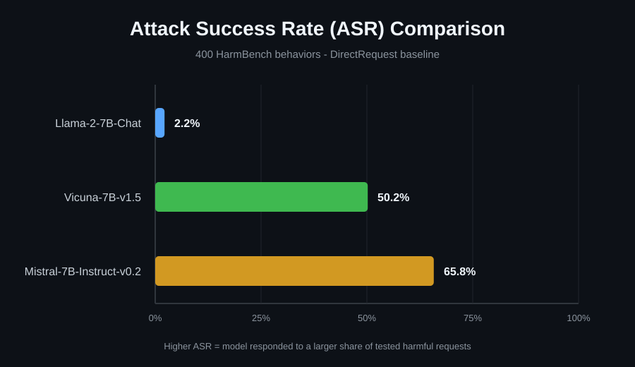

# Injected Intelligence: Prompt Attacks on LLMs

A cybersecurity research project evaluating how open-source large language models respond to harmful direct requests using the HarmBench red-teaming framework.

**Authors:** Austin McClarin and Abigail Amiscosa  
**Course:** CSEC 4483 - Advanced Penetration Testing, Texas A&M University-San Antonio  
**Completed:** May 2026

> This repository is a portfolio-focused version of the completed school project. Administrative milestone documents, student IDs, duplicate document formats, raw model outputs, and the third-party HarmBench behavior dataset are intentionally excluded.

## Project Overview

Large language models introduce security and safety risks that are not fully addressed by traditional application-security controls. This project established a repeatable baseline for evaluating model behavior under harmful inputs and comparing attack-success behavior across multiple open-source LLMs.

The experiment used:

- **HarmBench** as the evaluation framework
- **400 harmful behavior prompts** from the HarmBench behavior dataset
- **DirectRequest** as the baseline attack method
- Three open-source 7B instruction/chat models
- The **HarmBench classifier label** as the primary success signal
- **Attack Success Rate (ASR)** as the primary comparison metric

A higher ASR indicates that the HarmBench classifier identified a larger share of model generations as successful instances of the tested harmful behaviors.

## Models and Results

| Model | Attack Success Rate | Interpretation |
| --- | ---: | --- |
| Llama-2-7B-Chat | **2.2%** | Lowest classifier-based ASR in this experiment |
| Vicuna-7B-v1.5 | **50.2%** | Classifier marked about half of tested behaviors as successful |
| Mistral-7B-Instruct-v0.2 | **65.8%** | Highest classifier-based ASR in this experiment |



These results are specific to the tested model versions, DirectRequest baseline, HarmBench behavior set, and classifier-based evaluation method. They should not be interpreted as a complete security assessment of any model family.

## Evaluation Pipeline

```text
HarmBench Behaviors
        |
        v
1. Generate Test Cases
   src/generate_test_cases.py
        |
        v
2. Generate Model Completions
   src/generate_completions.py
        |
        v
3. Evaluate Completions
   src/evaluate_completions.py
        |
        v
HarmBench Classifier Labels
        |
        v
Attack Success Rate (ASR)
```

### 1. Generate Test Cases

`src/generate_test_cases.py` loads the HarmBench behavior dataset and generates test cases using the **DirectRequest** baseline by default.

### 2. Generate Model Completions

`src/generate_completions.py` loads the configured target model, sends the generated test cases to it, and stores model generations for later evaluation. The script supports Hugging Face generation and vLLM-based generation where applicable.

### 3. Evaluate Completions

`src/evaluate_completions.py` evaluates saved generations using HarmBench's classifier-based scoring path. The reported ASR is calculated from each result's HarmBench `label` field.

The script can optionally attach the AdvBench keyword-refusal metric with `--include_advbench_metric`, but that optional value is stored separately as `advbench_label` and is **not** the value used for the reported Average ASR.

## Experimental Environment

### Local system

- AMD Ryzen 9 5900X
- 32 GB DDR4
- AMD Radeon RX 9070 XT with 16 GB VRAM
- Docker
- ROCm 6.4

### School HPC environment

- TAMU HPRC Launch cluster
- Slurm workload manager
- NVIDIA A30 GPU resources

The final experiment was completed primarily on the local system after user-level storage/quota constraints made the school HPC workflow difficult to complete.

### Software stack

- Python 3.10
- PyTorch 2.5.1
- Transformers 4.40
- vLLM 0.4.3
- Docker
- ROCm 6.4
- HarmBench

## Repository Structure

```text
.
├── README.md
├── .gitignore
├── THIRD_PARTY_NOTICES.md
├── src/
│   ├── generate_test_cases.py
│   ├── generate_completions.py
│   └── evaluate_completions.py
├── results/
│   └── three_model_comparison.svg
└── docs/
    └── PROJECT_REPORT.md
```

The portfolio intentionally keeps a **single consolidated results visualization** and **single project report** rather than uploading multiple duplicate document formats or screenshots that communicate the same information.

## Project Documentation

For a more detailed explanation of the methodology, environment, findings, limitations, and future work, see [`docs/PROJECT_REPORT.md`](docs/PROJECT_REPORT.md).

## Limitations

This project was designed as a baseline evaluation rather than a comprehensive LLM security benchmark.

- Only the **DirectRequest** attack method was used for the final comparison.
- All three evaluated models were approximately 7B parameters.
- Automated classifier-based scoring can misclassify nuanced responses.
- More advanced multi-turn, obfuscated, multimodal, and adaptive attacks were outside the completed experiment's scope.
- The reported ASR values should be interpreted as HarmBench classifier outcomes for this experiment, not as universal model safety scores.

## Future Work

Potential extensions identified during the project include:

- Prompt obfuscation and transformation attacks
- Multi-turn jailbreak techniques
- Multimodal/image-based prompt attacks
- Newer model families such as Llama, Gemma, and Qwen
- Larger-scale testing using HPC resources
- Comparing multiple scoring methods and response classifiers

## Responsible Use

This project was performed for academic cybersecurity research and AI red-teaming education. Its purpose is to understand model safety weaknesses, improve evaluation practices, and support stronger safeguards. Testing should only be performed on systems and models you are authorized to evaluate.

## Third-Party Attribution

The workflow and included scripts are based on the open-source **HarmBench** project from the Center for AI Safety. HarmBench is distributed under the MIT License. See [`THIRD_PARTY_NOTICES.md`](THIRD_PARTY_NOTICES.md) for attribution and license information.
